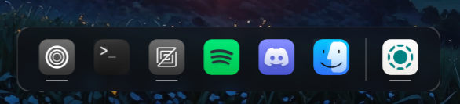

# hyprDock

Native rust dock for hyprland composed desktop environments. Upon the first launch both pins.json and style.css get created in .config/hyprDock. Live style editing is possible.
The dock style can be altered via the launch flags in the terminal.

## flags

- MacOS style dock: hyprDock pill / hyprDock --pill / hyprDock -p
  

- Notch style dock: hyprDock notch / hyprDock --notch / hyprDock -n
  

## Functionalities

- (Un)Pinning apps to the dock
- Jumping to open windows
- Opening new windows
- Closing windows
- Dynamic resizing
- MacOS style dock
- Notch style dock

## possible extensions

- different bar positions
